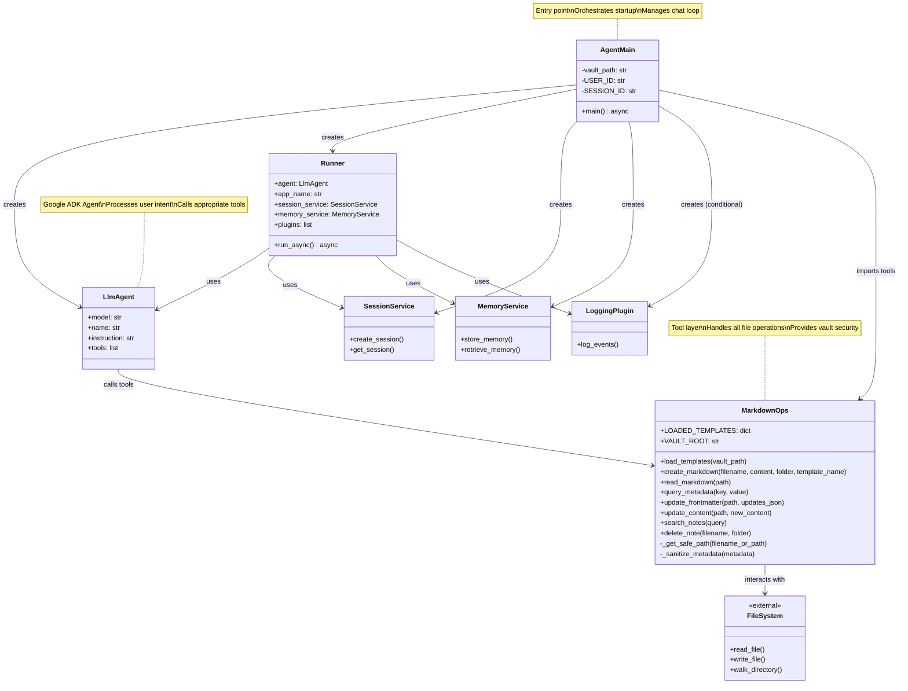

# AIKB Component Diagram

This diagram shows the structural organization and relationships between components in the AIKB system.

## Overview

The architecture follows a layered approach:
- **Orchestration Layer**: `AgentMain` coordinates startup and runtime
- **Agent Layer**: Google ADK's `LlmAgent` and `Runner` handle AI processing
- **Service Layer**: Session, Memory, and Logging services support the agent
- **Tool Layer**: `MarkdownOps` provides file system abstraction
- **Storage Layer**: File system operations for vault management

## Diagram

## Component Responsibilities

### AgentMain
- Application entry point and orchestrator
- Loads templates and scans vault structure
- Creates and configures all components
- Manages the user interaction loop

### LlmAgent
- Google ADK's AI agent (Gemini 2.5 Flash)
- Analyzes user intent and decides on actions
- Invokes appropriate tools based on context
- Follows system instructions for safety and validation

### Runner
- Manages agent execution lifecycle
- Handles session and memory persistence
- Streams events back to the application
- Integrates plugins (e.g., logging)

### MarkdownOps
- Abstracts all file system operations
- Provides secure vault access (path validation)
- Manages template cache (`LOADED_TEMPLATES`)
- Implements CRUD operations for markdown files

### Services
- **SessionService**: Manages user sessions
- **MemoryService**: Stores conversation history
- **LoggingPlugin**: Provides observability (conditional on `DEBUG` flag)

## Design Patterns

- **Dependency Injection**: Services injected into Runner
- **Template Method**: Templates loaded once, reused many times
- **Tool Pattern**: Agent uses declarative tools, not direct file access
- **Security Layer**: All file operations validated through `_get_safe_path()`

## Related Files

- [`src/agent.py`](file:///Users/dev/repos/aikb/src/agent.py) - Contains `AgentMain` and orchestration logic
- [`src/tools/markdown_ops.py`](file:///Users/dev/repos/aikb/src/tools/markdown_ops.py) - Contains `MarkdownOps` tool implementations
