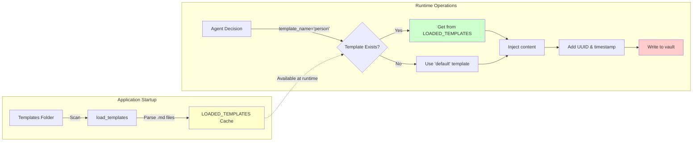

# AIKB Data Flow Diagram - Template Loading

This diagram shows how templates are loaded at startup and used at runtime.

## Overview

The template system follows a two-phase approach:
1. **Startup Phase**: Templates are loaded from the vault into an in-memory cache
2. **Runtime Phase**: Agent requests templates by name, which are retrieved from cache and used to create notes

This design ensures fast template access and consistent note creation.

## Diagram



## Template Loading Process

### Startup Phase

1. **Scan Templates Folder**: `load_templates()` walks the `Templates/` directory
2. **Parse Files**: Each `.md` file is read and parsed with frontmatter
3. **Cache Templates**: Templates stored in `LOADED_TEMPLATES` dict with lowercase keys
   - Example: `Person.md` → `LOADED_TEMPLATES['person']`

### Runtime Phase

1. **Agent Decision**: Agent analyzes user intent and determines template name
   - "Create a person note" → `template_name='person'`
   - "Create a project note" → `template_name='project'`
2. **Template Lookup**: Check if template exists in cache
3. **Fallback**: If template not found, use `'default'` template
4. **Content Injection**: User-provided content merged with template
5. **Metadata Generation**: Add UUID and timestamp to frontmatter
6. **File Creation**: Write complete note to vault

## Template Structure

Templates are markdown files with YAML frontmatter:

```yaml
---
type: Person
tags: []
company: ""
role: ""
---

# Content section
Additional information goes here
```

## Benefits of Template Caching

- **Performance**: Templates loaded once, not on every note creation
- **Consistency**: All notes use the same template version during runtime
- **Fast Access**: O(1) lookup by template name
- **Extensibility**: New templates auto-discovered on restart

## Adding New Templates

1. Create a new `.md` file in the `Templates/` folder (e.g., `Meeting.md`)
2. Restart the application to load the new template
3. Agent can now use `template_name='meeting'` to create meeting notes

## Related Files

- [`src/agent.py`](file:///Users/dev/repos/aikb/src/agent.py) - Calls `load_templates()` at startup
- [`src/tools/markdown_ops.py`](file:///Users/dev/repos/aikb/src/tools/markdown_ops.py) - Implements template loading and caching
