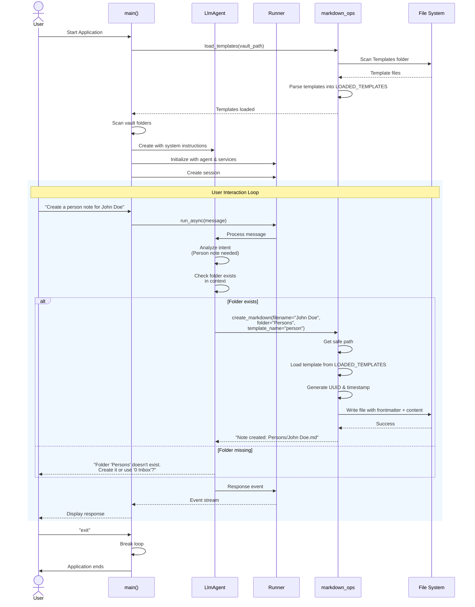

# AIKB Sequence Diagram - Agent Tool Interaction

This diagram shows the detailed interaction flow when a user requests to create a note.

## Overview

This sequence illustrates:
- How the application initializes and loads templates
- The message flow from user input to agent response
- Conditional logic for folder validation
- File system operations through the tools layer

## Diagram

## Key Interactions

### Startup Phase
1. Templates are loaded from the vault into memory cache
2. Vault folder structure is scanned for context
3. Agent is created with dynamic system instructions
4. Session is initialized for the user

### Runtime Phase
1. User sends natural language request
2. Agent analyzes intent and determines required template
3. Agent validates folder exists in scanned context
4. Tool creates note with proper frontmatter and content
5. Response is streamed back to user

## Security Features

- **Folder Validation**: Agent checks if target folder exists before creating notes
- **Path Safety**: `_get_safe_path()` prevents path traversal attacks
- **Template Caching**: Templates loaded once at startup, not on every request

## Related Files

- [`src/agent.py`](file:///Users/dev/repos/aikb/src/agent.py) - Orchestrates the interaction flow
- [`src/tools/markdown_ops.py`](file:///Users/dev/repos/aikb/src/tools/markdown_ops.py) - Implements the tools called by the agent
