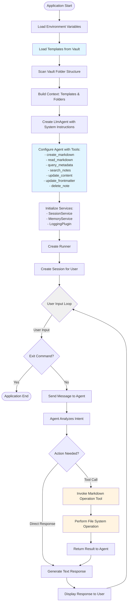

# AIKB System Flowchart

This flowchart shows the overall workflow from application startup through the user interaction loop.

## Overview

The system follows these main phases:
1. **Initialization**: Load environment, templates, and scan vault structure
2. **Configuration**: Create agent, configure tools, initialize services
3. **Runtime**: User interaction loop with agent processing and tool invocation

## Diagram

## Key Points

- **Blue nodes**: Template and configuration phases (one-time setup)
- **Yellow nodes**: Tool invocation and file operations (runtime actions)
- **Gray node**: Main user interaction loop
- The chat loop continues until user enters "exit" or "quit"
- Agent can either invoke tools or respond directly based on user intent

## Related Files

- [`src/agent.py`](file:///Users/dev/repos/aikb/src/agent.py) - Main application entry point
- [`src/tools/markdown_ops.py`](file:///Users/dev/repos/aikb/src/tools/markdown_ops.py) - Tool implementations
